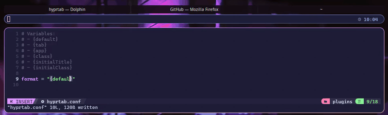

# Hyprtab

Hyprland plugin to format window titles

<p align="center">
  
</p>

## Install

```
hyprpm add https://github.com/semigarden/hyprtab

hyprpm enable hyprtab
```

## Config

`default` `tab` `app` `class` `initialTitle` `initialClass`

```
# ~/.config/hypr/plugins/hyprtab.conf

format = "{tab}"
```

